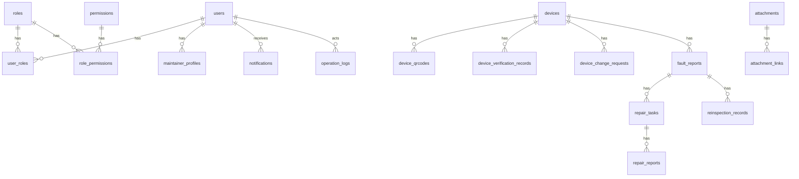

# RDVP 数据库设计

## 文档信息

| 项目 | 内容 |
| --- | --- |
| 项目名称 | RDVP |
| 文档名称 | 数据库设计 |
| 文档版本 | v0.1 |
| 文档状态 | 草案 |
| 创建日期 | 2026-05-27 |

## 1. 设计范围

本文档定义 RDVP 后端服务的核心数据模型。数据模型覆盖用户、角色权限、设备、二维码、设备核验、设备信息变更、故障报告、维修任务、维修报告、复检、附件、通知、离线同步、审计日志和安全事件。

后端数据库基线采用 PostgreSQL + PostGIS。文档中的逻辑类型用于表达业务语义，物理实现优先映射为 PostgreSQL 类型，例如 `datetime` 映射为 `TIMESTAMPTZ`，`json` 映射为 `JSONB`。

## 2. 命名约定

| 对象 | 规则 | 示例 |
| --- | --- | --- |
| 表名 | 小写 snake_case，使用复数名词 | `devices` |
| 字段名 | 小写 snake_case | `device_code` |
| 主键 | 统一使用 `id` | `id` |
| 外键 | 使用 `<entity>_id` | `device_id` |
| 时间字段 | 使用 `_at` 后缀 | `created_at` |
| 布尔字段 | 使用 `is_` 或 `has_` 前缀 | `is_active` |
| 状态字段 | 使用 `status` | `status` |

## 3. 逻辑类型

| 类型 | 说明 |
| --- | --- |
| `id` | 全局唯一字符串标识 |
| `string(n)` | 指定长度字符串 |
| `text` | 长文本 |
| `integer` | 整数 |
| `decimal(p,s)` | 定点小数 |
| `boolean` | 布尔值 |
| `datetime` | UTC 时间 |
| `json` | JSON 对象 |

## 4. 公共字段

大多数业务表包含以下公共字段：

| 字段 | 类型 | 必填 | 说明 |
| --- | --- | --- | --- |
| `id` | id | 是 | 主键 |
| `created_at` | datetime | 是 | 创建时间 |
| `created_by` | id | 否 | 创建人 |
| `updated_at` | datetime | 是 | 更新时间 |
| `updated_by` | id | 否 | 更新人 |
| `deleted_at` | datetime | 否 | 软删除时间 |

审计日志、附件、离线同步记录等不可变或追加型数据可不使用 `updated_by` 和 `deleted_at`。

## 5. 实体关系概览



## 6. 用户与权限

### 6.1 users

用户账号表。

| 字段 | 类型 | 必填 | 约束 | 说明 |
| --- | --- | --- | --- | --- |
| `id` | id | 是 | PK | 用户 ID |
| `username` | string(64) | 是 | UNIQUE | 登录账号 |
| `password_hash` | string(255) | 是 |  | 密码哈希 |
| `display_name` | string(100) | 是 |  | 显示名称 |
| `phone` | string(32) | 否 |  | 手机号 |
| `email` | string(128) | 否 |  | 邮箱 |
| `status` | string(32) | 是 | INDEX | 用户状态 |
| `last_login_at` | datetime | 否 |  | 最近登录时间 |
| `created_at` | datetime | 是 |  | 创建时间 |
| `created_by` | id | 否 | FK users.id | 创建人 |
| `updated_at` | datetime | 是 |  | 更新时间 |
| `updated_by` | id | 否 | FK users.id | 更新人 |
| `deleted_at` | datetime | 否 |  | 软删除时间 |

用户状态：

```text
ACTIVE
DISABLED
LOCKED
```

### 6.2 roles

角色表。

| 字段 | 类型 | 必填 | 约束 | 说明 |
| --- | --- | --- | --- | --- |
| `id` | id | 是 | PK | 角色 ID |
| `code` | string(64) | 是 | UNIQUE | 角色编码 |
| `name` | string(100) | 是 |  | 角色名称 |
| `description` | text | 否 |  | 角色说明 |
| `is_system` | boolean | 是 |  | 是否系统内置角色 |
| `created_at` | datetime | 是 |  | 创建时间 |
| `updated_at` | datetime | 是 |  | 更新时间 |

核心角色编码：

```text
SYSTEM_ADMIN
DEVICE_ADMIN
FIELD_OPERATOR
MAINTAINER
REINSPECTOR
SUPERVISOR_AUDITOR
READ_ONLY
```

### 6.3 permissions

权限表。

| 字段 | 类型 | 必填 | 约束 | 说明 |
| --- | --- | --- | --- | --- |
| `id` | id | 是 | PK | 权限 ID |
| `code` | string(100) | 是 | UNIQUE | 权限编码 |
| `name` | string(100) | 是 |  | 权限名称 |
| `description` | text | 否 |  | 权限说明 |
| `created_at` | datetime | 是 |  | 创建时间 |
| `updated_at` | datetime | 是 |  | 更新时间 |

### 6.4 user_roles

用户角色关联表。

| 字段 | 类型 | 必填 | 约束 | 说明 |
| --- | --- | --- | --- | --- |
| `user_id` | id | 是 | PK, FK users.id | 用户 ID |
| `role_id` | id | 是 | PK, FK roles.id | 角色 ID |
| `created_at` | datetime | 是 |  | 创建时间 |
| `created_by` | id | 否 | FK users.id | 创建人 |

唯一约束：

```text
UNIQUE(user_id, role_id)
```

### 6.5 role_permissions

角色权限关联表。

| 字段 | 类型 | 必填 | 约束 | 说明 |
| --- | --- | --- | --- | --- |
| `role_id` | id | 是 | PK, FK roles.id | 角色 ID |
| `permission_id` | id | 是 | PK, FK permissions.id | 权限 ID |
| `created_at` | datetime | 是 |  | 创建时间 |
| `created_by` | id | 否 | FK users.id | 创建人 |

唯一约束：

```text
UNIQUE(role_id, permission_id)
```

### 6.6 maintainer_profiles

维修人员扩展信息表。

| 字段 | 类型 | 必填 | 约束 | 说明 |
| --- | --- | --- | --- | --- |
| `id` | id | 是 | PK | 维修人员资料 ID |
| `user_id` | id | 是 | UNIQUE, FK users.id | 用户 ID |
| `availability_status` | string(32) | 是 | INDEX | 空闲状态 |
| `current_longitude` | decimal(10,7) | 否 |  | 当前经度 |
| `current_latitude` | decimal(10,7) | 否 |  | 当前纬度 |
| `location_updated_at` | datetime | 否 |  | 位置更新时间 |
| `service_radius_km` | decimal(6,2) | 否 |  | 可服务半径 |
| `created_at` | datetime | 是 |  | 创建时间 |
| `updated_at` | datetime | 是 |  | 更新时间 |

空闲状态：

```text
AVAILABLE
BUSY
OFFLINE
UNAVAILABLE
```

索引：

```text
INDEX(availability_status)
INDEX(current_longitude, current_latitude)
```

## 7. 设备

### 7.1 devices

设备基础信息表。

| 字段 | 类型 | 必填 | 约束 | 说明 |
| --- | --- | --- | --- | --- |
| `id` | id | 是 | PK | 设备 ID |
| `device_code` | string(64) | 是 | UNIQUE | 设备编号 |
| `name` | string(128) | 是 | INDEX | 设备名称 |
| `model` | string(128) | 否 | INDEX | 型号 |
| `manufacturer` | string(128) | 否 |  | 厂商 |
| `status` | string(32) | 是 | INDEX | 设备状态 |
| `address` | string(255) | 否 |  | 设备地址 |
| `longitude` | decimal(10,7) | 否 |  | 经度 |
| `latitude` | decimal(10,7) | 否 |  | 纬度 |
| `last_verification_time` | datetime | 否 | INDEX | 最近核验时间 |
| `remark` | text | 否 |  | 备注 |
| `created_at` | datetime | 是 |  | 创建时间 |
| `created_by` | id | 否 | FK users.id | 创建人 |
| `updated_at` | datetime | 是 |  | 更新时间 |
| `updated_by` | id | 否 | FK users.id | 更新人 |
| `deleted_at` | datetime | 否 |  | 软删除时间 |

设备状态使用 API 文档中的设备状态枚举。

索引：

```text
UNIQUE(device_code)
INDEX(status)
INDEX(name)
INDEX(model)
INDEX(longitude, latitude)
```

附近查询和地理围栏类能力应优先使用 PostGIS 空间类型与空间索引；当前经纬度组合索引用于早期筛选和本地联调。

### 7.2 device_qrcodes

设备二维码防伪信息表。

| 字段 | 类型 | 必填 | 约束 | 说明 |
| --- | --- | --- | --- | --- |
| `id` | id | 是 | PK | 二维码记录 ID |
| `device_id` | id | 是 | FK devices.id, INDEX | 设备 ID |
| `version` | integer | 是 |  | 二维码版本 |
| `nonce` | string(128) | 是 | UNIQUE | 随机标识 |
| `signature_hash` | string(255) | 是 |  | 签名摘要 |
| `status` | string(32) | 是 | INDEX | 二维码状态 |
| `issued_at` | datetime | 是 |  | 签发时间 |
| `expires_at` | datetime | 否 | INDEX | 过期时间 |
| `revoked_at` | datetime | 否 |  | 吊销时间 |
| `created_at` | datetime | 是 |  | 创建时间 |
| `created_by` | id | 否 | FK users.id | 创建人 |

二维码状态：

```text
ACTIVE
EXPIRED
REVOKED
```

## 8. 设备核验

### 8.1 device_verification_records

设备状态核验记录表。

| 字段 | 类型 | 必填 | 约束 | 说明 |
| --- | --- | --- | --- | --- |
| `id` | id | 是 | PK | 核验记录 ID |
| `device_id` | id | 是 | FK devices.id, INDEX | 设备 ID |
| `verifier_id` | id | 是 | FK users.id, INDEX | 核验人员 |
| `result` | string(32) | 是 | INDEX | 核验结果 |
| `description` | text | 否 |  | 核验说明 |
| `longitude` | decimal(10,7) | 否 |  | 核验经度 |
| `latitude` | decimal(10,7) | 否 |  | 核验纬度 |
| `verified_at` | datetime | 是 | INDEX | 核验时间 |
| `created_at` | datetime | 是 |  | 创建时间 |
| `created_by` | id | 是 | FK users.id | 创建人 |

核验结果：

```text
NORMAL
ABNORMAL
PENDING_VERIFICATION
```

索引：

```text
INDEX(device_id, verified_at)
INDEX(verifier_id, verified_at)
```

## 9. 设备信息变更

### 9.1 device_change_requests

设备信息变更申请表。

| 字段 | 类型 | 必填 | 约束 | 说明 |
| --- | --- | --- | --- | --- |
| `id` | id | 是 | PK | 变更申请 ID |
| `device_id` | id | 是 | FK devices.id, INDEX | 设备 ID |
| `applicant_id` | id | 是 | FK users.id, INDEX | 申请人 |
| `status` | string(32) | 是 | INDEX | 申请状态 |
| `previous_device_status` | string(32) | 是 |  | 申请创建前设备状态 |
| `reason` | text | 是 |  | 申请原因 |
| `changes` | json | 是 |  | 字段变更内容 |
| `reviewer_id` | id | 否 | FK users.id, INDEX | 审核人 |
| `review_comment` | text | 否 |  | 审核意见 |
| `reviewed_at` | datetime | 否 | INDEX | 审核时间 |
| `freeze_until` | datetime | 否 | INDEX | 审核通过后的变更冻结截止时间 |
| `created_at` | datetime | 是 |  | 创建时间 |
| `created_by` | id | 是 | FK users.id | 创建人 |
| `updated_at` | datetime | 是 |  | 更新时间 |
| `updated_by` | id | 否 | FK users.id | 更新人 |

申请状态使用 API 文档中的设备信息变更申请状态枚举。

`changes` 示例：

```json
{
  "location.address": {
    "oldValue": "Old address",
    "newValue": "New address"
  },
  "status": {
    "oldValue": "NORMAL",
    "newValue": "PENDING_VERIFICATION"
  }
}
```

约束：

```text
INDEX(device_id, status)
INDEX(applicant_id, created_at)
INDEX(reviewer_id, reviewed_at)
```

## 10. 故障与维修

### 10.1 fault_reports

故障报告表。

| 字段 | 类型 | 必填 | 约束 | 说明 |
| --- | --- | --- | --- | --- |
| `id` | id | 是 | PK | 故障报告 ID |
| `fault_report_no` | string(64) | 是 | UNIQUE | 故障报告编号 |
| `device_id` | id | 是 | FK devices.id, INDEX | 设备 ID |
| `reporter_id` | id | 是 | FK users.id, INDEX | 报告人 |
| `fault_type` | string(64) | 是 | INDEX | 故障类型 |
| `severity` | string(32) | 是 | INDEX | 故障等级 |
| `description` | text | 是 |  | 故障描述 |
| `status` | string(32) | 是 | INDEX | 故障状态 |
| `occurred_at` | datetime | 是 | INDEX | 发生时间 |
| `reported_longitude` | decimal(10,7) | 否 |  | 上报经度 |
| `reported_latitude` | decimal(10,7) | 否 |  | 上报纬度 |
| `closed_at` | datetime | 否 | INDEX | 关闭时间 |
| `closed_by` | id | 否 | FK users.id | 关闭人 |
| `created_at` | datetime | 是 |  | 创建时间 |
| `created_by` | id | 是 | FK users.id | 创建人 |
| `updated_at` | datetime | 是 |  | 更新时间 |
| `updated_by` | id | 否 | FK users.id | 更新人 |

故障状态和故障等级使用 API 文档中的枚举。

索引：

```text
UNIQUE(fault_report_no)
INDEX(device_id, status)
INDEX(reporter_id, created_at)
INDEX(severity, status)
INDEX(reported_longitude, reported_latitude)
```

### 10.2 repair_tasks

维修任务表。

| 字段 | 类型 | 必填 | 约束 | 说明 |
| --- | --- | --- | --- | --- |
| `id` | id | 是 | PK | 维修任务 ID |
| `fault_report_id` | id | 是 | FK fault_reports.id, INDEX | 故障报告 ID |
| `maintainer_id` | id | 是 | FK users.id, INDEX | 维修人员 |
| `status` | string(32) | 是 | INDEX | 维修任务状态 |
| `accepted_longitude` | decimal(10,7) | 否 |  | 接取经度 |
| `accepted_latitude` | decimal(10,7) | 否 |  | 接取纬度 |
| `accepted_at` | datetime | 是 | INDEX | 接取时间 |
| `started_at` | datetime | 否 |  | 开始维修时间 |
| `completed_at` | datetime | 否 | INDEX | 完成时间 |
| `cancelled_at` | datetime | 否 |  | 取消时间 |
| `cancel_reason` | text | 否 |  | 取消原因 |
| `created_at` | datetime | 是 |  | 创建时间 |
| `updated_at` | datetime | 是 |  | 更新时间 |
| `updated_by` | id | 否 | FK users.id | 更新人 |

约束：

```text
INDEX(fault_report_id, status)
INDEX(maintainer_id, status)
```

同一故障在同一时间只能存在一个有效维修任务。具体数据库实现应通过唯一约束、部分唯一索引或事务锁保证并发接取一致性。

### 10.3 repair_reports

维修报告表。

| 字段 | 类型 | 必填 | 约束 | 说明 |
| --- | --- | --- | --- | --- |
| `id` | id | 是 | PK | 维修报告 ID |
| `repair_task_id` | id | 是 | UNIQUE, FK repair_tasks.id | 维修任务 ID |
| `fault_report_id` | id | 是 | FK fault_reports.id, INDEX | 故障报告 ID |
| `maintainer_id` | id | 是 | FK users.id, INDEX | 维修人员 |
| `repair_description` | text | 是 |  | 维修过程 |
| `repair_result` | string(32) | 是 | INDEX | 维修结果 |
| `replaced_parts` | json | 否 |  | 更换部件 |
| `repaired_at` | datetime | 是 | INDEX | 维修完成时间 |
| `requires_reinspection` | boolean | 是 | INDEX | 是否需要复检 |
| `created_at` | datetime | 是 |  | 创建时间 |
| `created_by` | id | 是 | FK users.id | 创建人 |

维修结果：

```text
REPAIRED
TEMPORARY_RESTORED
UNRESOLVED
```

## 11. 复检

### 11.1 reinspection_records

复检记录表。

| 字段 | 类型 | 必填 | 约束 | 说明 |
| --- | --- | --- | --- | --- |
| `id` | id | 是 | PK | 复检记录 ID |
| `fault_report_id` | id | 是 | FK fault_reports.id, INDEX | 故障报告 ID |
| `repair_report_id` | id | 是 | FK repair_reports.id, INDEX | 维修报告 ID |
| `reinspector_id` | id | 是 | FK users.id, INDEX | 复检人员 |
| `result` | string(32) | 是 | INDEX | 复检结果 |
| `description` | text | 否 |  | 复检说明 |
| `reinspected_at` | datetime | 是 | INDEX | 复检时间 |
| `created_at` | datetime | 是 |  | 创建时间 |
| `created_by` | id | 是 | FK users.id | 创建人 |

复检结果使用 API 文档中的复检结果枚举。

索引：

```text
INDEX(fault_report_id, reinspected_at)
INDEX(reinspector_id, reinspected_at)
```

## 12. 附件

### 12.1 attachments

附件元数据表。

| 字段 | 类型 | 必填 | 约束 | 说明 |
| --- | --- | --- | --- | --- |
| `id` | id | 是 | PK | 附件 ID |
| `file_name` | string(255) | 是 |  | 原始文件名 |
| `storage_key` | string(500) | 是 | UNIQUE | 存储对象键 |
| `content_type` | string(128) | 是 | INDEX | 文件类型 |
| `size_bytes` | integer | 是 |  | 文件大小 |
| `checksum` | string(128) | 否 | INDEX | 文件校验值 |
| `uploaded_by` | id | 是 | FK users.id, INDEX | 上传人 |
| `created_at` | datetime | 是 | INDEX | 上传时间 |
| `deleted_at` | datetime | 否 |  | 删除时间 |

### 12.2 attachment_links

附件业务关联表。

| 字段 | 类型 | 必填 | 约束 | 说明 |
| --- | --- | --- | --- | --- |
| `id` | id | 是 | PK | 关联 ID |
| `attachment_id` | id | 是 | FK attachments.id, INDEX | 附件 ID |
| `business_type` | string(64) | 是 | INDEX | 业务类型 |
| `business_id` | id | 是 | INDEX | 业务对象 ID |
| `created_at` | datetime | 是 |  | 创建时间 |
| `created_by` | id | 是 | FK users.id | 创建人 |

业务类型：

```text
DEVICE_VERIFICATION_RECORD
DEVICE_CHANGE_REQUEST
FAULT_REPORT
REPAIR_REPORT
REINSPECTION_RECORD
```

约束：

```text
UNIQUE(attachment_id, business_type, business_id)
INDEX(business_type, business_id)
```

## 13. 通知

### 13.1 notifications

用户通知表。

| 字段 | 类型 | 必填 | 约束 | 说明 |
| --- | --- | --- | --- | --- |
| `id` | id | 是 | PK | 通知 ID |
| `recipient_id` | id | 是 | FK users.id, INDEX | 接收人 |
| `type` | string(64) | 是 | INDEX | 通知类型 |
| `title` | string(200) | 是 |  | 标题 |
| `content` | text | 否 |  | 内容摘要 |
| `business_type` | string(64) | 否 | INDEX | 业务类型 |
| `business_id` | id | 否 | INDEX | 业务对象 ID |
| `read_at` | datetime | 否 | INDEX | 已读时间 |
| `created_at` | datetime | 是 | INDEX | 创建时间 |

索引：

```text
INDEX(recipient_id, read_at, created_at)
INDEX(business_type, business_id)
```

## 14. 离线同步

### 14.1 offline_sync_batches

离线同步批次表。

| 字段 | 类型 | 必填 | 约束 | 说明 |
| --- | --- | --- | --- | --- |
| `id` | id | 是 | PK | 批次 ID |
| `client_batch_id` | string(128) | 是 | UNIQUE | 客户端批次 ID |
| `user_id` | id | 是 | FK users.id, INDEX | 提交用户 |
| `status` | string(32) | 是 | INDEX | 同步状态 |
| `submitted_at` | datetime | 是 | INDEX | 提交时间 |
| `created_at` | datetime | 是 |  | 创建时间 |

同步状态：

```text
PROCESSING
COMPLETED
PARTIALLY_FAILED
FAILED
```

### 14.2 offline_sync_records

离线同步记录表。

| 字段 | 类型 | 必填 | 约束 | 说明 |
| --- | --- | --- | --- | --- |
| `id` | id | 是 | PK | 同步记录 ID |
| `batch_id` | id | 是 | FK offline_sync_batches.id, INDEX | 批次 ID |
| `client_record_id` | string(128) | 是 | INDEX | 客户端记录 ID |
| `record_type` | string(64) | 是 | INDEX | 记录类型 |
| `payload` | json | 是 |  | 提交内容 |
| `status` | string(32) | 是 | INDEX | 处理状态 |
| `server_record_id` | id | 否 |  | 服务端生成记录 ID |
| `error_code` | string(100) | 否 |  | 错误码 |
| `error_message` | text | 否 |  | 错误信息 |
| `created_offline_at` | datetime | 是 |  | 离线创建时间 |
| `processed_at` | datetime | 否 | INDEX | 处理时间 |
| `created_at` | datetime | 是 |  | 创建时间 |

约束：

```text
UNIQUE(batch_id, client_record_id)
INDEX(record_type, status)
```

## 15. 审计与安全

### 15.1 operation_logs

操作日志表。

| 字段 | 类型 | 必填 | 约束 | 说明 |
| --- | --- | --- | --- | --- |
| `id` | id | 是 | PK | 操作日志 ID |
| `actor_id` | id | 否 | FK users.id, INDEX | 操作人 |
| `action` | string(100) | 是 | INDEX | 操作类型 |
| `target_type` | string(64) | 是 | INDEX | 操作对象类型 |
| `target_id` | id | 否 | INDEX | 操作对象 ID |
| `request_id` | string(128) | 否 | INDEX | 请求 ID |
| `ip_address` | string(64) | 否 |  | IP 地址 |
| `user_agent` | string(500) | 否 |  | 客户端信息 |
| `before_data` | json | 否 |  | 操作前数据 |
| `after_data` | json | 否 |  | 操作后数据 |
| `created_at` | datetime | 是 | INDEX | 操作时间 |

索引：

```text
INDEX(actor_id, created_at)
INDEX(target_type, target_id)
INDEX(action, created_at)
INDEX(request_id)
```

### 15.2 security_events

安全事件表。

| 字段 | 类型 | 必填 | 约束 | 说明 |
| --- | --- | --- | --- | --- |
| `id` | id | 是 | PK | 安全事件 ID |
| `event_type` | string(100) | 是 | INDEX | 事件类型 |
| `severity` | string(32) | 是 | INDEX | 严重程度 |
| `actor_id` | id | 否 | FK users.id, INDEX | 关联用户 |
| `target_type` | string(64) | 否 | INDEX | 关联对象类型 |
| `target_id` | id | 否 | INDEX | 关联对象 ID |
| `description` | text | 是 |  | 事件说明 |
| `metadata` | json | 否 |  | 扩展信息 |
| `created_at` | datetime | 是 | INDEX | 创建时间 |

事件类型示例：

```text
LOGIN_FAILED
QR_CODE_SIGNATURE_INVALID
QR_CODE_REPLAY_SUSPECTED
PERMISSION_DENIED
ATTACHMENT_TYPE_REJECTED
```

## 16. 核心约束

### 16.1 设备编号唯一

`devices.device_code` 全局唯一。设备编号是业务查询入口，不能重复。

### 16.2 二维码随机标识唯一

`device_qrcodes.nonce` 全局唯一。二维码校验应结合版本、设备编号、随机标识和签名摘要。

### 16.3 设备信息变更审核后生效

设备信息变更先写入 `device_change_requests`。审核通过后再更新 `devices`，并写入 `operation_logs`。

### 16.4 故障接取并发控制

同一故障在同一时间只能存在一个有效维修任务。后端实现接取时必须在数据库事务中完成故障状态检查、维修任务创建和故障状态更新。

### 16.5 重大故障复检

`repair_reports.requires_reinspection` 为 `true` 时，故障必须进入 `PENDING_REINSPECTION`。复检通过后才能关闭故障并恢复设备状态。

### 16.6 附件访问控制

附件文件内容不直接暴露存储路径。业务访问通过 `attachments` 和 `attachment_links` 判断附件归属，再结合用户权限返回文件内容。

## 17. 数据保留与删除

- 用户、设备、故障、维修、复检和审计类数据默认采用逻辑删除或状态变更。
- 审计日志和安全事件属于追溯数据，不参与普通业务删除。
- 附件删除应同时处理业务关联和实际文件存储。
- 涉及个人信息和敏感数据的保留周期需要在安全设计文档中进一步定义。

## 18. 待确认问题

- 主键生成策略。
- 经纬度附近查询的空间字段类型与索引策略。
- 故障报告编号生成规则。
- 设备编号生成规则。
- 附件文件校验算法。
- 审计日志保留周期。
- 是否需要多组织或多租户字段。
