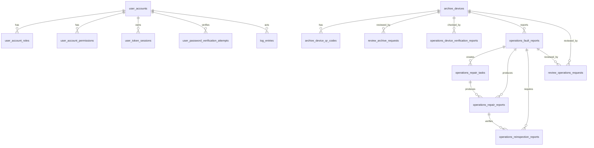

# RDVP 数据库设计

## 文档信息

| 项目 | 内容 |
| --- | --- |
| 项目名称 | RDVP |
| 文档名称 | 数据库设计 |
| 文档版本 | v0.2 |
| 文档状态 | 草案 |
| 创建日期 | 2026-05-27 |
| 最近更新 | 2026-07-02 |

## 1. 设计范围

本文档描述 RDVP 当前已落地的 PostgreSQL + PostGIS 物理 schema。当前版本覆盖用户认证、角色权限、档案、设备二维码、设备核验、故障报修、维修任务、维修报告、复检报告、档案审核、运维审核、日志查询、登录失败限制和敏感操作密码复核。

附件、通知、离线同步、独立安全事件表和多租户字段仍是后续预留设计，当前数据库不创建对应业务表。历史迁移中出现的旧表名只表示演进路径，当前运行态以本文档列出的物理表名为准。

## 2. 命名约定

| 对象 | 规则 | 示例 |
| --- | --- | --- |
| 表名 | 小写 snake_case，并以业务域作为前缀 | `archive_devices` |
| 业务域前缀 | 当前使用 `archive_`、`operations_`、`review_`、`log_`、`user_` | `operations_repair_tasks` |
| 字段名 | 小写 snake_case | `device_code` |
| 主键字段 | 统一使用 `id` | `id` |
| 外键字段 | 使用 `<entity>_id`，跨域时保留业务实体语义 | `fault_report_id` |
| 时间字段 | 使用 `_at` 后缀 | `created_at` |
| 状态字段 | 使用 `status` | `status` |
| 主键约束 | `pk_<table>` | `pk_archive_devices` |
| 唯一约束 | `uq_<table>_<column_or_purpose>` | `uq_user_accounts_username` |
| 外键约束 | `fk_<table>_<referenced_entity>` | `fk_operations_repair_tasks_fault_report` |
| 检查约束 | `ck_<table>_<rule>` | `ck_user_login_attempts_failed_count_nonnegative` |
| 普通索引 | `idx_<table>_<columns_or_purpose>` | `idx_operations_fault_reports_status_updated` |
| 部分唯一索引 | `ux_<table>_<purpose>` | `ux_operations_repair_tasks_active_fault` |

Flyway `V31__standardize_domain_table_names.sql` 负责表名与第一批索引名的域化；`V32__standardize_domain_constraint_names.sql` 负责主键、唯一约束、外键、检查约束和剩余索引名的域化。

## 3. 逻辑类型

| 类型 | 说明 |
| --- | --- |
| `id` | 全局唯一字符串标识，物理类型为 `VARCHAR(64)` |
| `string(n)` | 指定长度字符串 |
| `text` | 长文本 |
| `integer` | 整数 |
| `decimal(p,s)` | 定点小数 |
| `boolean` | 布尔值 |
| `datetime` | UTC 时间，物理类型为 `TIMESTAMPTZ` |
| `json` | JSON 对象，物理类型为 `JSONB` |

## 4. 实体关系概览

## 5. 用户域

### 5.1 `user_accounts`

用户账号表。

| 字段 | 类型 | 必填 | 约束 | 说明 |
| --- | --- | --- | --- | --- |
| `id` | id | 是 | `pk_user_accounts` | 用户 ID |
| `username` | string(64) | 是 | `uq_user_accounts_username` | 登录账号 |
| `password_hash` | string(255) | 是 |  | 密码哈希 |
| `display_name` | string(100) | 是 |  | 显示名称 |
| `status` | string(32) | 是 | `idx_user_accounts_status` | 用户状态 |
| `created_at` | datetime | 是 |  | 创建时间 |
| `updated_at` | datetime | 是 |  | 更新时间 |
| `deleted_at` | datetime | 否 |  | 删除时间 |

当前用户状态：`ACTIVE`、`DISABLED`、`LOCKED`。

### 5.2 `user_account_roles`

用户角色关联表。当前角色是代码枚举，不单独落角色表。

| 字段 | 类型 | 必填 | 约束 | 说明 |
| --- | --- | --- | --- | --- |
| `user_id` | id | 是 | `pk_user_account_roles`, `fk_user_account_roles_user_account` | 用户 ID |
| `role_code` | string(64) | 是 | `pk_user_account_roles`, `idx_user_account_roles_role_code` | 角色编码 |

### 5.3 `user_account_permissions`

用户权限关联表。当前权限是代码枚举，不单独落权限表。

| 字段 | 类型 | 必填 | 约束 | 说明 |
| --- | --- | --- | --- | --- |
| `user_id` | id | 是 | `pk_user_account_permissions`, `fk_user_account_permissions_user_account` | 用户 ID |
| `permission_code` | string(100) | 是 | `pk_user_account_permissions`, `idx_user_account_permissions_permission_code` | 权限编码 |

### 5.4 `user_token_sessions`

登录访问凭证会话表。

| 字段 | 类型 | 必填 | 约束 | 说明 |
| --- | --- | --- | --- | --- |
| `id` | id | 是 | `pk_user_token_sessions` | 会话 ID |
| `token_hash` | string(128) | 是 | `uq_user_token_sessions_token_hash` | Token 哈希 |
| `user_id` | id | 是 | `fk_user_token_sessions_user_account`, `idx_user_token_sessions_user_expires` | 用户 ID |
| `client_device_id` | string(128) | 否 |  | 客户端设备标识 |
| `expires_at` | datetime | 是 | `idx_user_token_sessions_expires` | 过期时间 |
| `created_at` | datetime | 是 |  | 创建时间 |
| `revoked_at` | datetime | 否 | `idx_user_token_sessions_revoked` | 撤销时间 |

### 5.5 `user_login_attempts`

登录失败限制表。

| 字段 | 类型 | 必填 | 约束 | 说明 |
| --- | --- | --- | --- | --- |
| `username` | string(64) | 是 | `pk_user_login_attempts` | 归一化登录账号 |
| `failed_count` | integer | 是 | `ck_user_login_attempts_failed_count_nonnegative` | 连续失败次数 |
| `locked_until` | datetime | 否 | `idx_user_login_attempts_locked_until` | 临时限制截止时间 |
| `updated_at` | datetime | 是 |  | 更新时间 |

### 5.6 `user_password_verification_attempts`

敏感操作密码复核尝试表。

| 字段 | 类型 | 必填 | 约束 | 说明 |
| --- | --- | --- | --- | --- |
| `user_id` | id | 是 | `pk_user_password_verification_attempts`, `fk_user_password_verification_attempts_user_account` | 用户 ID |
| `failed_count` | integer | 是 | `ck_user_password_verification_attempts_failed_count_nonnegative` | 连续失败次数 |
| `locked_until` | datetime | 否 | `idx_user_password_verification_attempts_locked_until` | 临时锁定截止时间 |
| `updated_at` | datetime | 是 |  | 更新时间 |
| `verified_until` | datetime | 否 | `idx_user_password_verification_attempts_verified_until` | 免重复复核截止时间 |

## 6. 档案域

### 6.1 `archive_devices`

档案主表。

| 字段 | 类型 | 必填 | 约束 | 说明 |
| --- | --- | --- | --- | --- |
| `id` | id | 是 | `pk_archive_devices` | 设备 ID |
| `device_code` | string(64) | 是 | `uq_archive_devices_device_code` | 设备编号 |
| `name` | string(128) | 是 | `idx_archive_devices_name` | 设备名称 |
| `model` | string(128) | 否 | `idx_archive_devices_model` | 型号 |
| `manufacturer` | string(128) | 否 |  | 厂商 |
| `status` | string(32) | 是 | `idx_archive_devices_status` | 设备状态 |
| `address` | string(255) | 否 |  | 设备地址 |
| `longitude` | decimal(10,7) | 否 | `idx_archive_devices_location`, `idx_archive_devices_location_geography` | 经度 |
| `latitude` | decimal(10,7) | 否 | `idx_archive_devices_location`, `idx_archive_devices_location_geography` | 纬度 |
| `last_verification_time` | datetime | 否 |  | 最近核验时间 |
| `remark` | text | 否 |  | 备注 |
| `created_at` | datetime | 是 |  | 创建时间 |
| `created_by` | id | 否 |  | 创建人 |
| `updated_at` | datetime | 是 |  | 更新时间 |
| `updated_by` | id | 否 |  | 更新人 |
| `deleted_at` | datetime | 否 |  | 删除时间 |
| `deleted_reason` | text | 否 |  | 删除原因 |

设备编号是业务查询入口，必须全局唯一。软删除设备仍保留编号占用历史，是否允许复用编号由后续业务规则另行确认。

### 6.2 `archive_device_qr_codes`

设备二维码防伪信息表。

| 字段 | 类型 | 必填 | 约束 | 说明 |
| --- | --- | --- | --- | --- |
| `id` | id | 是 | `pk_archive_device_qr_codes` | 二维码记录 ID |
| `device_id` | id | 是 | `fk_archive_device_qr_codes_device`, `idx_archive_device_qr_codes_device` | 设备 ID |
| `version` | integer | 是 |  | 二维码版本 |
| `nonce` | string(128) | 是 | `uq_archive_device_qr_codes_nonce` | 随机标识 |
| `signature_hash` | string(255) | 是 |  | 签名摘要 |
| `status` | string(32) | 是 | `idx_archive_device_qr_codes_status` | 二维码状态 |
| `issued_at` | datetime | 是 |  | 签发时间 |
| `expires_at` | datetime | 否 | `idx_archive_device_qr_codes_expires` | 过期时间 |
| `revoked_at` | datetime | 否 |  | 吊销时间 |
| `created_at` | datetime | 是 |  | 创建时间 |
| `created_by` | id | 否 |  | 创建人 |

二维码状态：`ACTIVE`、`EXPIRED`、`REVOKED`。

## 7. 运维域

### 7.1 `operations_device_verification_reports`

设备核验报告表。

| 字段 | 类型 | 必填 | 约束 | 说明 |
| --- | --- | --- | --- | --- |
| `id` | id | 是 | `pk_operations_device_verification_reports` | 核验报告 ID |
| `device_id` | id | 是 | `fk_operations_device_verification_reports_device`, `idx_operations_device_verification_reports_device_created` | 设备 ID |
| `operator_id` | id | 是 | `idx_operations_device_verification_reports_operator_created` | 核验人员 |
| `result` | string(32) | 是 | `idx_operations_device_verification_reports_result` | 核验结果 |
| `description` | text | 否 |  | 核验说明 |
| `remark` | text | 否 |  | 备注 |
| `verified_at` | datetime | 是 |  | 核验时间 |
| `created_at` | datetime | 是 |  | 创建时间 |

### 7.2 `operations_fault_reports`

故障报修表。

| 字段 | 类型 | 必填 | 约束 | 说明 |
| --- | --- | --- | --- | --- |
| `id` | id | 是 | `pk_operations_fault_reports` | 故障报告 ID |
| `fault_report_no` | string(64) | 是 | `uq_operations_fault_reports_fault_report_no` | 故障报告编号 |
| `device_id` | id | 是 | `fk_operations_fault_reports_device`, `idx_operations_fault_reports_device_status` | 设备 ID |
| `reporter_id` | id | 是 | `idx_operations_fault_reports_reporter` | 报告人 |
| `fault_type` | string(64) | 是 |  | 故障类型 |
| `severity` | string(32) | 是 | `idx_operations_fault_reports_severity` | 故障等级 |
| `status` | string(32) | 是 | `idx_operations_fault_reports_status_created`, `idx_operations_fault_reports_status_updated` | 故障状态 |
| `occurred_at` | datetime | 是 |  | 发生时间 |
| `description` | text | 是 |  | 故障描述 |
| `scene_condition` | text | 否 |  | 现场情况 |
| `longitude` | decimal(10,7) | 否 |  | 上报经度 |
| `latitude` | decimal(10,7) | 否 |  | 上报纬度 |
| `accepted_task_id` | id | 否 |  | 当前接取任务 ID |
| `closed_at` | datetime | 否 |  | 关闭时间 |
| `created_at` | datetime | 是 |  | 创建时间 |
| `updated_at` | datetime | 是 |  | 更新时间 |

`ux_operations_fault_reports_active_device` 保证同一设备同一时间只存在一个未关闭故障。

### 7.3 `operations_repair_tasks`

维修任务表。维修任务既承载普通维修，也承载复检任务接取后的任务壳，具体由 `task_type` 区分。

| 字段 | 类型 | 必填 | 约束 | 说明 |
| --- | --- | --- | --- | --- |
| `id` | id | 是 | `pk_operations_repair_tasks` | 维修任务 ID |
| `repair_task_no` | string(64) | 是 | `uq_operations_repair_tasks_repair_task_no` | 维修任务编号 |
| `fault_report_id` | id | 是 | `fk_operations_repair_tasks_fault_report`, `idx_operations_repair_tasks_fault_status` | 故障报告 ID |
| `maintainer_id` | id | 是 | `idx_operations_repair_tasks_maintainer_status`, `idx_operations_repair_tasks_maintainer_status_type` | 维修或复检人员 |
| `status` | string(32) | 是 |  | 任务状态 |
| `accepted_longitude` | decimal(10,7) | 否 |  | 接取经度 |
| `accepted_latitude` | decimal(10,7) | 否 |  | 接取纬度 |
| `accepted_at` | datetime | 是 |  | 接取时间 |
| `completed_at` | datetime | 否 |  | 完成时间 |
| `created_at` | datetime | 是 |  | 创建时间 |
| `updated_at` | datetime | 是 |  | 更新时间 |
| `task_type` | string(16) | 是 |  | 任务类型：`REPAIR` 或 `REINSPECTION` |

`ux_operations_repair_tasks_active_fault` 保证同一故障同一时间只存在一个有效维修任务。

### 7.4 `operations_repair_reports`

维修报告表。

| 字段 | 类型 | 必填 | 约束 | 说明 |
| --- | --- | --- | --- | --- |
| `id` | id | 是 | `pk_operations_repair_reports` | 维修报告 ID |
| `repair_report_no` | string(64) | 是 | `uq_operations_repair_reports_repair_report_no` | 维修报告编号 |
| `repair_task_id` | id | 是 | `uq_operations_repair_reports_repair_task`, `fk_operations_repair_reports_repair_task` | 维修任务 ID |
| `fault_report_id` | id | 是 | `fk_operations_repair_reports_fault_report`, `idx_operations_repair_reports_fault`, `idx_operations_repair_reports_fault_created` | 故障报告 ID |
| `maintainer_id` | id | 是 | `idx_operations_repair_reports_maintainer` | 维修人员 |
| `result` | string(32) | 是 | `idx_operations_repair_reports_result` | 维修结果 |
| `repaired_at` | datetime | 是 |  | 维修完成时间 |
| `process_description` | text | 是 |  | 维修过程 |
| `parts_used` | text | 否 |  | 使用部件 |
| `requires_reinspection` | boolean | 是 |  | 是否需要复检 |
| `created_at` | datetime | 是 |  | 创建时间 |

### 7.5 `operations_reinspection_reports`

复检报告表。

| 字段 | 类型 | 必填 | 约束 | 说明 |
| --- | --- | --- | --- | --- |
| `id` | id | 是 | `pk_operations_reinspection_reports` | 复检报告 ID |
| `reinspection_report_no` | string(64) | 是 | `uq_operations_reinspection_reports_reinspection_report_no` | 复检报告编号 |
| `fault_report_id` | id | 是 | `fk_operations_reinspection_reports_fault_report`, `idx_operations_reinspection_reports_fault` | 故障报告 ID |
| `repair_report_id` | id | 是 | `fk_operations_reinspection_reports_repair_report`, `ux_operations_reinspection_reports_repair_report` | 维修报告 ID |
| `reinspector_id` | id | 是 | `idx_operations_reinspection_reports_reinspector` | 复检人员 |
| `result` | string(32) | 是 | `idx_operations_reinspection_reports_result` | 复检结果 |
| `reinspected_at` | datetime | 是 |  | 复检时间 |
| `description` | text | 否 |  | 复检说明 |
| `created_at` | datetime | 是 |  | 创建时间 |

## 8. 审核域

### 8.1 `review_archive_requests`

档案添加、删除和修改审核申请表。

| 字段 | 类型 | 必填 | 约束 | 说明 |
| --- | --- | --- | --- | --- |
| `id` | id | 是 | `pk_review_archive_requests` | 档案审核申请 ID |
| `device_id` | id | 否 | `fk_review_archive_requests_device`, `idx_review_archive_requests_device_status` | 已存在设备 ID；添加档案申请可为空 |
| `applicant_id` | id | 是 |  | 申请人 |
| `status` | string(32) | 是 |  | 申请状态 |
| `previous_device_status` | string(32) | 是 |  | 申请前设备状态 |
| `reason` | text | 是 |  | 申请原因 |
| `changes` | json | 是 |  | 字段变更内容 |
| `reviewer_id` | id | 否 |  | 审核人 |
| `review_comment` | text | 否 |  | 审核意见 |
| `reviewed_at` | datetime | 否 |  | 审核时间 |
| `freeze_until` | datetime | 否 | `idx_review_archive_requests_freeze_until` | 审核结束后的冻结截止时间 |
| `created_at` | datetime | 是 |  | 创建时间 |
| `created_by` | id | 是 |  | 创建人 |
| `updated_at` | datetime | 是 |  | 更新时间 |
| `updated_by` | id | 否 |  | 更新人 |
| `request_type` | string(32) | 是 |  | 申请类型：`CREATE`、`UPDATE`、`DELETE` |
| `target_device_code` | string(64) | 否 | `ux_review_archive_requests_pending_target_code` | 目标设备编号 |
| `initiated_at` | datetime | 是 | `idx_review_archive_requests_initiated_at` | 申请发起时间 |

`ux_review_archive_requests_pending_device` 和 `ux_review_archive_requests_pending_target_code` 分别限制同一设备、同一目标设备编号不能同时存在待审核档案申请。冻结期统一为审核结束后 6 小时。

### 8.2 `review_operations_requests`

运维审核申请表。核验报告、报修报告、维修报告和复检报告提交后进入该表。

| 字段 | 类型 | 必填 | 约束 | 说明 |
| --- | --- | --- | --- | --- |
| `id` | id | 是 | `pk_review_operations_requests` | 运维审核申请 ID |
| `request_type` | string(32) | 是 |  | 审核类型 |
| `target_id` | id | 是 | `ux_review_operations_requests_target` | 被审核业务对象 ID |
| `target_no` | string(64) | 是 | `ux_review_operations_requests_target` | 被审核业务对象编号 |
| `fault_report_id` | id | 是 | `fk_review_operations_requests_fault_report`, `idx_review_operations_requests_fault` | 故障报告 ID |
| `device_id` | id | 是 | `fk_review_operations_requests_device` | 设备 ID |
| `operator_id` | id | 是 |  | 提交人 |
| `summary` | text | 是 |  | 审核摘要 |
| `status` | string(32) | 是 | `idx_review_operations_requests_status_submitted` | 审核状态 |
| `submitted_at` | datetime | 是 | `idx_review_operations_requests_status_submitted` | 提交时间 |
| `reviewer_id` | id | 否 | `idx_review_operations_requests_reviewer` | 审核人 |
| `review_comment` | text | 否 |  | 审核意见 |
| `reviewed_at` | datetime | 否 | `idx_review_operations_requests_reviewer` | 审核时间 |
| `created_at` | datetime | 是 |  | 创建时间 |
| `updated_at` | datetime | 是 |  | 更新时间 |

## 9. 日志域

### 9.1 `log_entries`

底层日志条目表。日志中心的档案操作日志、档案审核日志、运维操作日志和运维审核日志中，部分列表由业务表实时组合生成；该表用于保存跨业务操作条目。

| 字段 | 类型 | 必填 | 约束 | 说明 |
| --- | --- | --- | --- | --- |
| `id` | id | 是 | `pk_log_entries` | 日志 ID |
| `action` | string(100) | 是 | `idx_log_entries_action_occurred_at` | 操作类型 |
| `target_id` | id | 否 | `idx_log_entries_target` | 目标对象 ID |
| `target_no` | string(64) | 否 | `idx_log_entries_target` | 目标对象编号 |
| `actor_id` | id | 否 | `idx_log_entries_actor_occurred_at` | 操作人 ID |
| `actor_name` | string(100) | 否 |  | 操作人显示名称 |
| `status` | string(32) | 是 |  | 日志状态 |
| `description` | text | 否 |  | 日志描述 |
| `occurred_at` | datetime | 是 | `idx_log_entries_occurred_at` | 发生时间 |

日志状态：`SUCCESS`、`FAILED`。

## 10. 核心约束

### 10.1 档案写入受审核控制

档案的新增、删除和修改必须先写入 `review_archive_requests`。审核通过后，后端在事务内更新 `archive_devices` 并写入相关日志。

### 10.2 档案冻结期

档案申请审核结束后，不论通过或驳回，后端都必须设置 6 小时冻结期。冻结期从审核结束时间开始计算，移动端禁用入口只是体验层辅助。

### 10.3 故障接取并发控制

同一故障在同一时间只能存在一个有效维修任务。后端接取接口必须在数据库事务内完成故障状态检查、维修任务创建和故障状态更新。

### 10.4 重大故障复检

`operations_repair_reports.requires_reinspection` 为 `true` 时，故障必须进入待复检状态；复检通过后才能关闭故障并恢复设备状态。

### 10.5 登录和敏感操作防暴力尝试

登录失败写入 `user_login_attempts`。敏感操作密码复核失败写入 `user_password_verification_attempts`，校验通过后可在 `verified_until` 前免重复复核。

## 11. 数据保留与删除

- 用户、设备、故障、维修、复检和审核类数据默认采用状态变更或逻辑删除。
- 日志属于追溯数据，不参与普通业务删除。
- 涉及个人信息和敏感操作的数据保留周期需要在安全设计文档中进一步定义。

## 12. 待确认问题

- 主键生成策略是否继续使用应用侧字符串 ID。
- 经纬度附近查询是否进一步统一为 PostGIS geography 字段。
- 设备编号和各类报告编号是否需要独立序列表或号段表。
- 日志保留周期和归档策略。
- 后续用户中心是否引入个人设置、注册、注销和账号删除相关表。
- 是否需要多组织或多租户字段。
